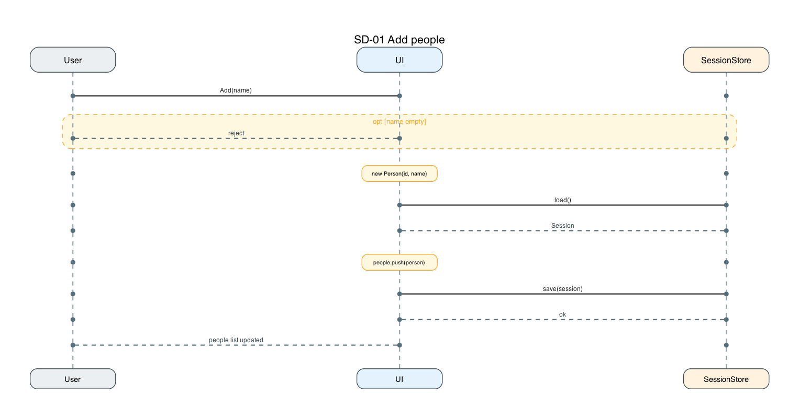
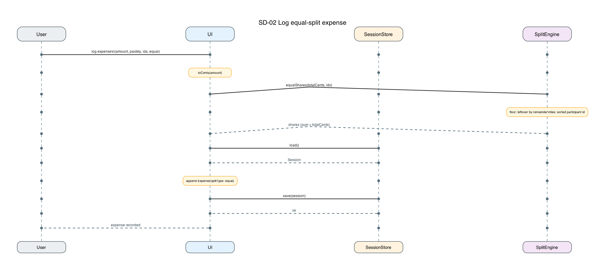
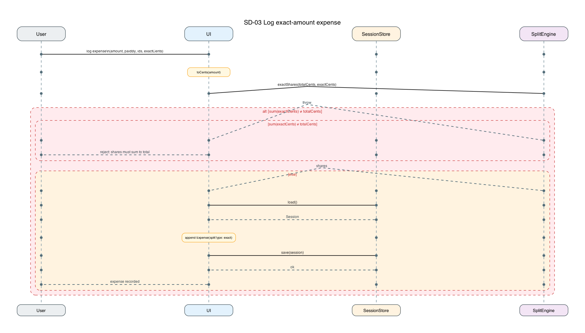
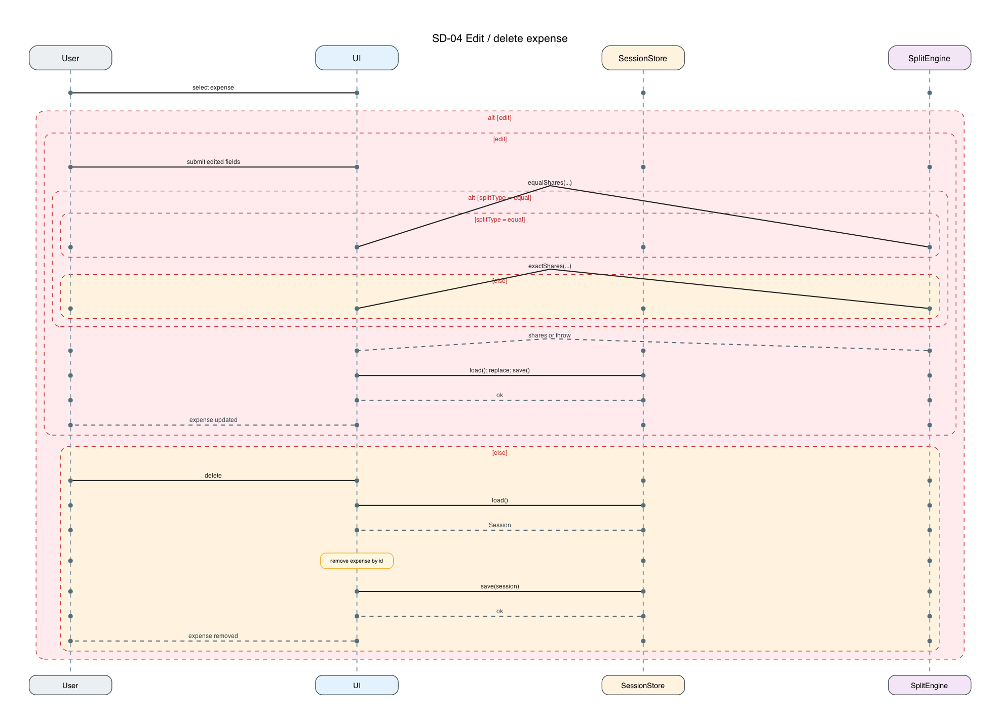
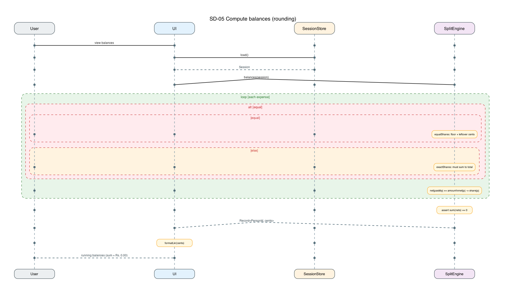
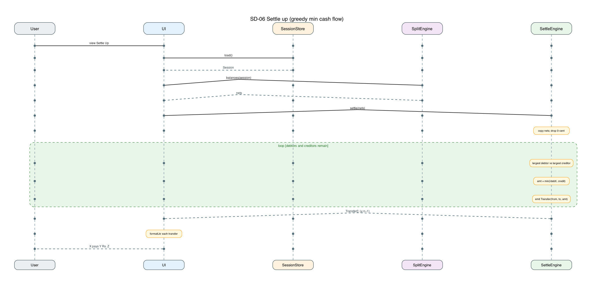

# Software Architecture Document — SplitWay

**Version:** 1.0  
**Status:** Draft for implementation  
**Related:** `docs/PROJECT_PROPOSAL.md` (source of requirements)

SplitWay is a single-session, browser-only tool for splitting shared expenses in Sri Lankan Rupees (LKR). There is no login, no accounts, and no server. This document records the runtime components, the integer-cent data model, the rounding rule that keeps balances at zero, the greedy settle-up rule, and UML 2.0 sequence diagrams for the six core flows.

---

## 1. Purpose and scope

The architecture exists so the UI, persistence, split math, and settlement can be built independently against one locked contract.

In scope:

- One anonymous user in one browser tab
- People, expenses (equal or exact-amount), running balances, settle-up
- Persistence in `localStorage` under `splitway:v1`
- All money as integer cents

Out of scope: authentication, multi-device sync, percentage splits, multiple currencies, a backend.

---

## 2. Constraints

| Constraint | Decision |
|---|---|
| Identity | No user accounts. Anyone with the tab is the actor. |
| Currency | LKR only. Display as rupees; compute as integer cents. |
| Arithmetic | No IEEE-754 for money. Parse to cents once; every share and transfer is an integer. |
| Persistence | `localStorage` key `splitway:v1`. If `window` is missing (tests), an in-memory map. |
| Settlement | Greedy largest-debtor vs largest-creditor, not pairwise IOUs. At most `n−1` transfers for `n` people with a non-zero net. |
| UI stack (intended) | Next.js App Router + TypeScript. This document does not implement it. |

---

## 3. Logical view — components

Four components. The UI is the only thing the user talks to. Engines are pure functions. The store is the only I/O.

```
┌─────────┐     load / save      ┌──────────────┐
│   UI    │ ←──────────────────→ │ SessionStore │
│         │                      │ localStorage │
│         │                      │ splitway:v1  │
│         │  equalShares /       └──────────────┘
│         │  exactShares /
│         │  balances            ┌─────────────┐
│         │ ←──────────────────→ │ SplitEngine │
│         │                      └─────────────┘
│         │  settle(nets)        ┌──────────────┐
│         │ ←──────────────────→ │ SettleEngine │
└─────────┘                      └──────────────┘
```

### 3.1 UI

Renders four sections in order: people, expenses, balances, settle up. Converts typed rupee strings to cents via `toCents` before calling an engine. After every successful mutation it `save`s the session and re-reads balances so the screen cannot drift from stored state.

Does not implement rounding or settlement itself.

### 3.2 SessionStore

Owns the `Session` document.

- Key: `splitway:v1`
- `load(): Session` — missing or empty key yields `{ people: [], expenses: [] }`
- `save(session: Session): void` — JSON serialize the whole session (replace, do not merge)

No partial writes. The session is the unit of persistence.

### 3.3 SplitEngine

Pure. Given a session (or a single expense), returns shares and nets in integer cents.

| Function | Role |
|---|---|
| `toCents(input)` | Parse rupee string/number → integer cents |
| `formatLkr(cents)` | Integer cents → display string |
| `equalShares(totalCents, participantIds)` | Floor + leftover cents (see §5) |
| `exactShares(totalCents, exactCents)` | Validate sum; return the map or throw |
| `balances(session)` | For each person, paid minus share; `sum === 0` |

### 3.4 SettleEngine

Pure. `settle(nets) → Transfer[]`. See §6. Does not read the store. Does not format currency.

---

## 4. Data model

Money is always `number` meaning **integer cents**. Rs. 12,000.00 is `1_200_000`. Never store a rupee float.

```ts
export type PersonId = string
export type Person = { id: PersonId; name: string }
export type SplitType = "equal" | "exact"

export type Expense = {
  id: string
  amountCents: number
  paidBy: PersonId
  participantIds: PersonId[]
  splitType: SplitType
  exactCents?: Record<PersonId, number>
}

export type Session = { people: Person[]; expenses: Expense[] }

export type Transfer = { from: PersonId; to: PersonId; amountCents: number }
```

| Type | Invariants |
|---|---|
| `Person` | `id` unique in the session; `name` non-empty after trim |
| `Expense` | `amountCents > 0`; `paidBy` is a known person; `participantIds` non-empty and known; for `exact`, `exactCents` keys are the participants and `sum(exactCents) === amountCents` |
| `Session` | Expenses only reference people that exist at save time |
| `Transfer` | `amountCents > 0`; `from ≠ to` |

Net sign: **positive** = the person is owed money overall; **negative** = the person owes. A transfer `from A to B` moves cents from A’s debt toward B’s credit.

---

## 5. Rounding

The requirement: if Rs. 100 is split three ways, balances must reconcile to zero — not Rs. 99.99 and not Rs. 100.01. The rule is:

1. Convert the expense to integer cents once (`toCents`).
2. Every split’s shares **sum to `totalCents`**.
3. Equal split uses the largest-remainder method with a deterministic tie-break.
4. Exact split **rejects** if the supplied cents do not sum to `totalCents`. Do not renormalize. Do not compare rupee decimals with IEEE-754.

### 5.1 Equal split

```
n      = participantIds.length
base   = floor(totalCents / n)          // integer division
left   = totalCents - base * n          // leftover cents, 0 .. n-1
share[id] = base for every participant
```

Distribute `left` extra cents, one per participant, in this order:

1. **Largest remainder.** For an equal split the fractional remainder is the same for everyone (`totalCents % n` is shared), so this step does not discriminate.
2. **Tie-break:** lexicographically **sorted participant id**. The first `left` ids in that order each get `+1` cent.

Shares then sum to `totalCents` by construction.

**Worked example — Rs. 100.00 among 3 people** (`totalCents = 10000`, ids `a`, `b`, `c`):

| Person | floor | leftover cent | share (cents) | rupees |
|---|---|---|---|---|
| a | 3333 | +1 (first sorted id) | 3334 | 33.34 |
| b | 3333 | | 3333 | 33.33 |
| c | 3333 | | 3333 | 33.33 |
| **sum** | | | **10000** | **100.00** |

If ids were UUIDs, sort the UUID strings; do not sort by display name. Name edits must not reshuffle leftover cents.

### 5.2 Exact-amount split

`exactCents` is already in cents. If `sum(values) !== totalCents`, throw and the UI must not persist the expense. No silent repair.

### 5.3 Running balances

For each expense:

- `net[paidBy] += amountCents`
- `net[p] -= share[p]` for each participant `p`

A payer who is also a participant is counted once on each side (paid the total, owes their share). People not on `participantIds` get no share. After all expenses, `sum(nets) === 0`. Display with `formatLkr`.

---

## 6. Settle up

Goal: the fewest payments that drive every net to zero. Not a list of every pairwise debt.

```
settle(nets):
  copy nets; drop entries whose value is 0
  debtors    = people with net < 0   // they owe
  creditors  = people with net > 0   // they are owed
  transfers  = []
  while debtors and creditors are non-empty:
    d = debtor with largest |net|
    c = creditor with largest net
    amt = min(|d.net|, c.net)
    emit Transfer { from: d.id, to: c.id, amountCents: amt }
    d.net += amt
    c.net -= amt
    drop anyone who reached 0
  return transfers
```

Ties when picking largest debtor/creditor: sorted participant id (stable, same spirit as leftover cents). Ignore 0-cent leftovers; never emit a zero transfer.

Upper bound: at most `n−1` transfers for `n` people who have a non-zero net.

---

## 7. Persistence

`SessionStore` serializes the whole `Session` as JSON under `splitway:v1`. Reload of the tab calls `load()` before the first render. There is no migration scheme in v1: a missing or unparsable value is treated as an empty session.

---

## 8. Process view — sequence diagrams

Lifelines are only those that participate: **User**, **UI**, **SessionStore**, **SplitEngine**, **SettleEngine**.

Synchronous calls are solid arrows; returns are dashed. Combined fragments: `opt`, `alt`, `loop`.

DOT sources, PNGs, and draw.io files live in `docs/diagrams/`. Regenerate with:

```bash
"$HOME/.cursor/skills/azure-architecture-diagrams/.venv/bin/python" \
  docs/diagrams/scripts/generate.py
```

### SD-01 Add people

User supplies a name. Empty names are rejected (`opt`). Otherwise the UI creates a `Person`, `load`s the session, appends, and `save`s.



### SD-02 Log equal-split expense

Amount is converted to cents, then `equalShares` applies floor + leftover cents. The new `Expense` (`splitType: "equal"`) is appended and saved. Shares already sum to the total, so later `balances` cannot drift.



### SD-03 Log exact-amount expense

`exactShares` is the gate. **alt:** if cents do not sum to `totalCents`, the engine throws and the UI rejects — nothing is written. **else:** append `splitType: "exact"` and save.



### SD-04 Edit / delete expense

**alt [edit]:** re-run `equalShares` or `exactShares` on the new fields, replace the expense in the session, save. A failing exact sum is the same reject as SD-03. **alt [delete]:** remove by id and save. Balances are not stored; they are recomputed on the next read.



### SD-05 Compute balances (rounding / remainder cents)

`balances(session)` walks every expense, chooses equal vs exact, and accumulates paid minus share. The leftover-cent rule from §5 runs inside `equalShares`. The engine asserts `sum(nets) === 0` before returning.



### SD-06 Settle up (greedy min cash flow)

UI loads the session, asks SplitEngine for nets, then SettleEngine for `Transfer[]`. The loop matches the current largest debtor to the current largest creditor for `min(|debt|, credit)` until every net is zero.



---

## 9. Acceptance walkthrough (sanity scenario)

People: Alice, Bob, Carol, Dave. Amounts in cents.

| # | Expense | Split |
|---|---|---|
| 1 | Alice paid `1_200_000` | equal among all four → `300_000` each |
| 2 | Carol paid `1_000_000` | exact: Alice `333_333`, Bob `333_333`, Dave `333_334` (Carol not a participant) |
| 3 | Dave paid `600_000` | equal Dave and Bob → `300_000` each |

Nets after all three:

| Person | cents | rupees |
|---|---|---|
| Alice | `+566_667` | +5,666.67 |
| Bob | `−933_333` | −9,333.33 |
| Carol | `+700_000` | +7,000.00 |
| Dave | `−333_334` | −3,333.34 |
| **sum** | **0** | **0.00** |

Greedy settle (largest |debt| vs largest credit):

1. Bob pays Carol `700_000` (Rs. 7,000.00)
2. Dave pays Alice `333_334` (Rs. 3,333.34)
3. Bob pays Alice `233_333` (Rs. 2,333.33)

Three transfers, which is `n−1` for four people with mixed signs — not the six pairwise IOUs.

---

## 10. Mapping to source (intended)

Not implemented in this change. Recorded so later work does not invent a second API.

| Component | Intended home |
|---|---|
| UI | `src/app/**`, `src/components/**` |
| SessionStore | `src/lib/store.ts` |
| SplitEngine | `src/lib/money.ts`, `src/lib/splits.ts`, `src/lib/balances.ts` |
| SettleEngine | `src/lib/settle.ts` |
| Types | `src/lib/types.ts` |
